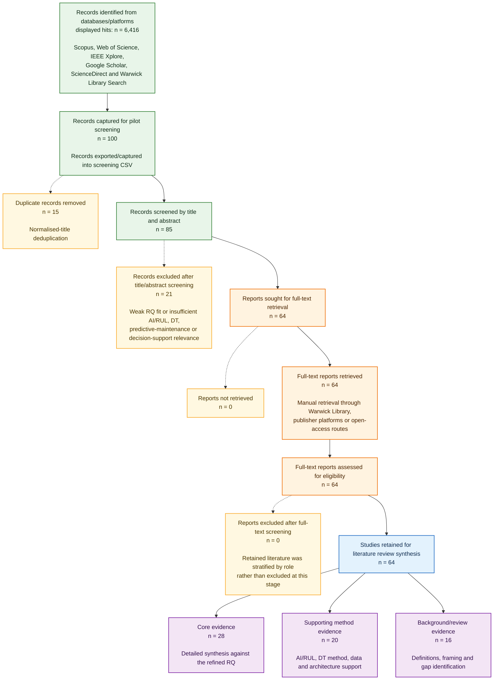

# PRISMA-Informed Flow Chart, Final Full-Text Version

Use this version for the dissertation after full-text retrieval and quality appraisal.

Suggested caption:

Figure X. PRISMA-informed literature selection flow for the dissertation review. The 6,416 identification count is a displayed-hit count across search platforms and includes overlap; the structured screening set comprised 100 captured records. Following full-text retrieval, all 64 reports were assessed and retained, then stratified into core evidence, supporting method evidence and background/review evidence according to their role in the synthesis.
